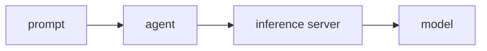
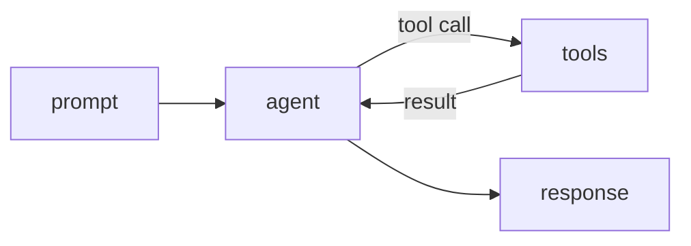
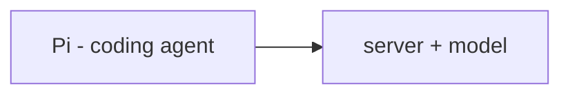
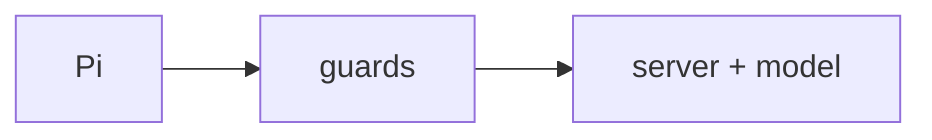
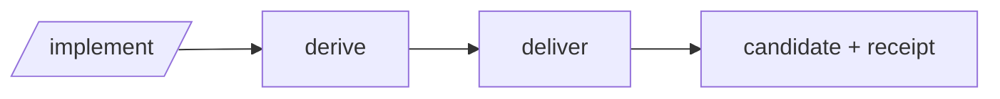
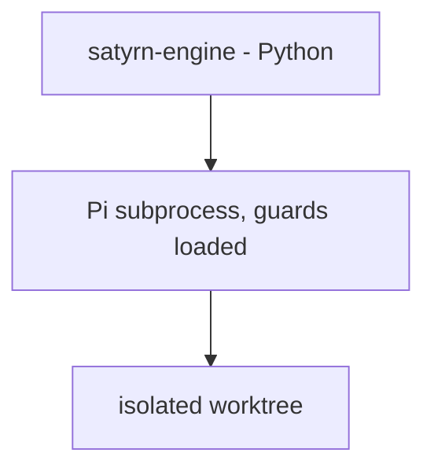
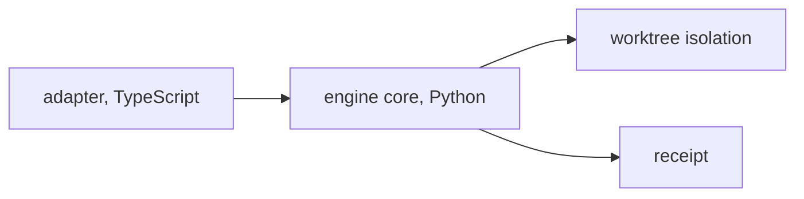
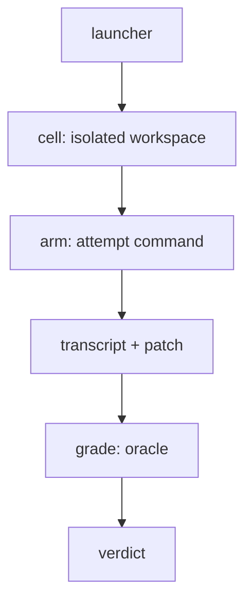
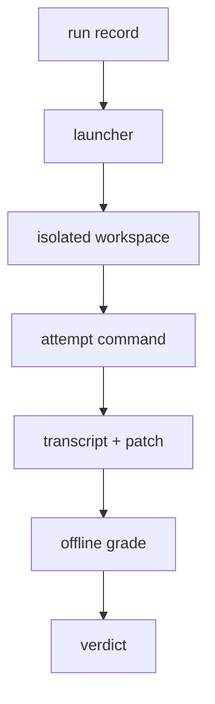

# Public Site Implementation Plan

> **For agentic workers:** REQUIRED SUB-SKILL: Use superpowers:subagent-driven-development (recommended) or superpowers:executing-plans to implement this plan task-by-task. Steps use checkbox (`- [ ]`) syntax for tracking.

**Goal:** Rebuild the Zensical docs site in `site/` from a record site into the public-facing site described by the spec, with a new home page, a "How it works" diagram arc, sectioned navigation, and an authored Evals glossary.

**Architecture:** The site is Zensical (`docs_dir = "site"`, `site_dir = "_build"`), canonical docs included by reference with `--8<--` so no number can drift. Pages are flat Markdown in `site/`; navigation is a nested TOML array in `zensical.toml`. New diagrams are Mermaid fenced blocks. Every new site file gets a provenance row.

**Tech Stack:** Zensical 0.0.63, Python-Markdown + pymdownx.snippets/superfences, Mermaid, uv.

**Spec:** `docs/superpowers/specs/2026-09-23-public-site-design.md` — the plan argues from the spec, so the spec travels with it; executors read both.

## Global Constraints

- Zensical pinned `==0.0.63`; build with `uv run --group docs zensical build --strict`.
- Canonical docs are included by reference only (`--8<-- "docs/..."`); never copy their text into a site page.
- Every `site/**` file must appear in `zensical.toml` `nav` (the test `test_every_site_page_is_in_the_navigation` enforces it).
- Every new `site/**` file needs a `PROVENANCE.md` row via `uv run python tools/provenance.py new <path>`.
- Engine pages (`engine.md`, `engine-usage.md`, `engine-glossary.md`) are synced from `satyrn-engine @ 78ab87d`; do not edit their bodies.
- Naming: **Laptop AI**, **SatyrnAI**, org **`satyrn-ai`**, site title **Satyrn Evals and Satyrn Engine**.
- `just gates` must exit 0 at the end of Task 12.

**Intermediate red build is anticipated, not a defect to stop on.** Task 1 sets
the full navigation up front, so `uv run --group docs zensical build --strict`
fails from Task 1 until Task 11 (the nav names pages that do not exist yet).
The pytest suite, ruff, lint-docs, and provenance stay green throughout; only
`just docs` is red, and its fix is Tasks 2–11. Commit at task boundaries as
normal and do not stop on that specific red build.

---

### Task 1: Config — Mermaid, site_name, and the nested nav

**Files:**
- Modify: `zensical.toml`
- Modify: `tests/test_docs_site.py`

**Interfaces:**
- Produces: `[project.markdown_extensions]` with the Mermaid superfences fence; `[project].site_name`; `[project].nav` as the nested tree below. Later tasks create the files this nav names.

- [ ] **Step 1: Write the failing tests**

Add to `tests/test_docs_site.py`:

```python
def test_the_config_declares_the_mermaid_fence() -> None:
    ext = _config()["project"]["markdown_extensions"]
    fences = ext.get("pymdownx", {}).get("superfences", {}).get("custom_fences", [])
    assert {"name": "mermaid"} in [dict(f) for f in fences]


def test_the_nav_names_the_new_pages_in_order() -> None:
    nav = _nav_paths(_config()["project"]["nav"])
    for rel in (
        "how-it-works.md",
        "numbers.md",
        "measurement.md",
        "evals-about.md",
        "evals-architecture.md",
        "use-evals.md",
        "authoring.md",
        "engine.md",
        "engine-architecture.md",
        "engine-usage.md",
        "engine-glossary.md",
        "models.md",
        "pathologies.md",
        "remediations.md",
        "contributing.md",
        "glossary.md",
    ):
        assert rel in nav, rel
```

Also update `test_the_canonical_files_the_site_includes_are_present` to add `"docs/pathologies.md"` and `"docs/remediations.md"` to its tuple.

- [ ] **Step 2: Run the tests, expect failure**

Run: `uv run pytest tests/test_docs_site.py -q`
Expected: the two new tests FAIL (Mermaid fence absent; new pages absent from nav).

- [ ] **Step 3: Rewrite `zensical.toml`**

```toml
[project]
site_name = "Satyrn Evals and Satyrn Engine"
docs_dir = "site"
site_dir = "_build"
nav = [
  { "Home" = "index.md" },
  { "How it works" = "how-it-works.md" },
  { "First results" = "numbers.md" },
  { "Release one — the stated negative" = "release-one-negative.md" },
  { "Measurement" = "measurement.md" },
  { "Evals" = [
    { "About Satyrn Evals" = "evals-about.md" },
    { "Architecture" = "evals-architecture.md" },
    { "Using Evals" = "use-evals.md" },
    { "Authoring" = "authoring.md" },
  ] },
  { "Engine" = [
    { "About Satyrn Engine" = "engine.md" },
    { "Architecture" = "engine-architecture.md" },
    { "Using Engine" = "engine-usage.md" },
    { "Glossary" = "engine-glossary.md" },
  ] },
  { "Satyrn Models" = "models.md" },
  { "Lessons" = "lessons.md" },
  { "Pathologies" = "pathologies.md" },
  { "Remediations" = "remediations.md" },
  { "Contributing" = "contributing.md" },
  { "Glossary" = "glossary.md" },
]

[project.markdown_extensions]
pymdownx.snippets = {}
pymdownx.superfences.custom_fences = [
  { name = "mermaid", class = "mermaid", format = "pymdownx.superfences.fence_code_format" },
]

[project.validation]
invalid_links = true
invalid_link_anchors = true
```

- [ ] **Step 4: Verify the two new tests pass, but `just docs` still fails**

Run: `uv run pytest tests/test_docs_site.py -q` — the new tests pass.
Run: `uv run --group docs zensical build --strict` — FAILS: nav names files that do not exist yet. That is expected; do not "fix" it here.

- [ ] **Step 5: Commit**

```bash
git add zensical.toml tests/test_docs_site.py
git commit -m "site: Mermaid fence and the new nested nav"
```

---

### Task 2: Home page

**Files:**
- Modify: `site/index.md`

**Interfaces:**
- Consumes: the nav from Task 1 (this page is `index.md`).
- Produces: the landing copy whose first markdown link is `numbers.md` (existing test), and the strings asserted by the new test below.

- [ ] **Step 1: Write the failing test**

Add to `tests/test_docs_site.py`:

```python
def test_the_landing_page_carries_the_public_copy() -> None:
    text = (SITE / "index.md").read_text()
    for fragment in (
        "start with evidence",
        "Part of the SatyrnAI project",
        "Laptop AI",
        "petri dish",
    ):
        assert fragment in text, fragment
```

- [ ] **Step 2: Run it, expect failure**

Run: `uv run pytest tests/test_docs_site.py::test_the_landing_page_carries_the_public_copy -q`
Expected: FAIL.

- [ ] **Step 3: Write the page**

Replace `site/index.md` entirely:

```markdown
---
title: Satyrn Evals and Satyrn Engine
---

# Satyrn Evals and Satyrn Engine

You have a great idea to speed up AI. Your agent encourages your brilliance
and starts building. And building. Four quadrillion tokens later, nobody
understands anything, you're painted into a corner, and you find it isn't
actually solving a problem — because you didn't start with evidence.

Satyrn Evals is a deep, deliberately over-deep way to find pathologies and
experiment with remedies. Small models need help. Evals gives you the
confidence that you're on the right track, and that you can deliver something
into an Engine.

The evidence is in [the numbers](numbers.md): a pre-registered comparison of
`/implement` against bare Pi on medium-build tasks, read once when complete,
with where it did not help and what it costs.

**The shape.** Evals is the star; Engine is the petri dish where remedies get
tested. Later Engine becomes a routine-Python tool for Laptop AI. For now, we
are a group of people learning how to measure and investigate for Laptop AI.
Read [how it works](how-it-works.md) for the whole story in diagrams.

**The honest scope.** Satyrn Engine is not ready to be an everyday addition to
your agent. In 0.1 it is a good implementer for medium-sized tasks in routine
Laptop AI Python work.

**Join.** Follow us on Mastodon — **TBD**.

> **FYI.** Two repositories today (`satyrn-engine`, `satyrn-evals`), both under
> `pauleveritt`; this site lives at `pauleveritt.github.io/satyrn-evals/`.
> After 0.1 they fold into one repository under `satyrn-ai`.

## Part of the SatyrnAI project

SatyrnAI builds tools for **Laptop AI** — link **TBD**.
```

- [ ] **Step 4: Verify**

Run: `uv run pytest tests/test_docs_site.py -q`
Run: `uv run --group docs zensical build --strict`
Expected: all pass (the nav's remaining missing files still fail the build — ignore until their tasks land; if the build fails here on a *missing page other than the ones this task has not created yet*, stop and re-read the nav).

- [ ] **Step 5: Provenance + commit**

```bash
uv run python tools/provenance.py new site/index.md
git add site/index.md PROVENANCE.md
git commit -m "site: public home page"
```

---

### Task 3: How it works

**Files:**
- Create: `site/how-it-works.md`

**Interfaces:**
- Produces: the three-section diagram page; sections are plain `##` headings with Mermaid fenced blocks.

- [ ] **Step 1: Write the failing test**

Add to `tests/test_docs_site.py`:

```python
def test_how_it_works_has_three_sections_and_diagrams() -> None:
    text = (SITE / "how-it-works.md").read_text()
    assert "## How agents work" in text
    assert "## How the Engine works" in text
    assert "## How Evals works" in text
    assert text.count("```mermaid") >= 6
```

- [ ] **Step 2: Run it, expect failure**

Run: `uv run pytest tests/test_docs_site.py::test_how_it_works_has_three_sections_and_diagrams -q`
Expected: FAIL (file absent).

- [ ] **Step 3: Write the page**

Create `site/how-it-works.md`:

```markdown
---
title: How it works
---

# How it works

The whole story, from a prompt to an eval verdict, in three sections. Each
section hides the previous section's "out there" complexity and collapses it
to one block.

## How agents work

A prompt goes to an agent, which talks to an inference server, which runs a
model:



Add tools, a loop, and planning:



Running locally, the same shape: Pi is the agent, oMLX serves Ornith 1.5 9B.


## How the Engine works

Pi is the coding agent; the server and model collapse to one block:



Add guards — the loop breaker, writable-path scope, symbol preservation, and
command bounds:



Add `/implement`, at a high level: derive a contract, then deliver:



The Engine's pieces: a Python core runs a fresh Pi subprocess, guards loaded,
in its own isolated worktree:



Worktree isolation and the logical pieces inside:



## How Evals works

The logical pieces of the eval system, in the glossary's words:



The *physical* run — how the launcher makes the workspace and runs the model
as a subprocess — is on the [Architecture](evals-architecture.md) page.
```

- [ ] **Step 4: Verify**

Run: `uv run pytest tests/test_docs_site.py -q`
Run: `uv run --group docs zensical build --strict`
Expected: pass (modulo still-missing pages from later tasks).

- [ ] **Step 5: Provenance + commit**

```bash
uv run python tools/provenance.py new site/how-it-works.md
git add site/how-it-works.md PROVENANCE.md
git commit -m "site: how-it-works diagram arc"
```

---

### Task 4: First results rename + Measurement page

**Files:**
- Modify: `site/numbers.md` (front matter only)
- Create: `site/measurement.md`

**Interfaces:**
- Produces: `numbers.md` titled "First results"; `measurement.md` describing how the claim was measured.

- [ ] **Step 1: Write the failing test**

Add to `tests/test_docs_site.py`:

```python
def test_first_results_and_measurement_titles() -> None:
    assert (SITE / "numbers.md").read_text().startswith("---\ntitle: First results")
    assert "## How the claim was measured" in (SITE / "measurement.md").read_text()
```

- [ ] **Step 2: Run it, expect failure**

Run: `uv run pytest tests/test_docs_site.py::test_first_results_and_measurement_titles -q`
Expected: FAIL.

- [ ] **Step 3: Write the pages**

In `site/numbers.md`, change only the front matter line `title: The numbers` to `title: First results`.

Create `site/measurement.md`:

```markdown
---
title: Measurement
---

# Measurement

How the claim on [the numbers](numbers.md) page was produced, and where the
instrument was checked against itself.

## How the claim was measured

Release two was pre-registered on 2026-09-19 and read once, when complete. A
45-cell Baseline census ran first to classify where bare Pi actually fails,
then three route proofs (one void), a 12-cell pilot, and the comparison. The
primary reading is a one-sided Fisher exact test on `selfhost-run-record-gate`
at 24 cells per arm.

## The instrument gaps, stated

The harness grades only retained evidence, and its own gaps are disclosed
beside the numbers: the wrong-worktree read for budget-stopped Engine cells,
the one-model one-machine caveat, and the route that led to the claim.

See also [the stated negative](release-one-negative.md) and
[lessons](lessons.md) for what release one got wrong before the harness was
fixed.
```

- [ ] **Step 4: Verify**

Run: `uv run pytest tests/test_docs_site.py -q`
Run: `uv run --group docs zensical build --strict`
Expected: pass (modulo later tasks).

- [ ] **Step 5: Provenance + commit**

```bash
uv run python tools/provenance.py new site/measurement.md
git add site/numbers.md site/measurement.md PROVENANCE.md
git commit -m "site: First results rename and measurement page"
```

---

### Task 5: Evals — About

**Files:**
- Create: `site/evals-about.md`

**Interfaces:**
- Produces: the "why / how / what" page for the Evals harness, linking to the glossary and architecture.

- [ ] **Step 1: Write the failing test**

Add to `tests/test_docs_site.py`:

```python
def test_evals_about_names_why_how_what() -> None:
    text = (SITE / "evals-about.md").read_text()
    for fragment in ("## Why", "## How", "## What", "glossary.md"):
        assert fragment in text, fragment
```

- [ ] **Step 2: Run it, expect failure**

Run: `uv run pytest tests/test_docs_site.py::test_evals_about_names_why_how_what -q`
Expected: FAIL.

- [ ] **Step 3: Write the page**

Create `site/evals-about.md`:

```markdown
---
title: About Satyrn Evals
---

# About Satyrn Evals

## Why

Small models need help, and help is only help if you can measure it. Before
Satyrn, we built remedies for failures we had not diagnosed — and the failures
turned out to be our own harness's. Evals exists so a claim about a model or
an engine is a measurement, not a story.

## How

Evals captures a task, runs an attempt command in an isolated workspace,
preserves the patch and transcript, and grades the retained evidence offline.
The engine seam is an executable command, so the suite runs against a fake
command and never imports engine internals.

## What

Tasks, isolated cells, a launcher, grading from retained evidence, and the
census that classifies where an arm actually fails. The vocabulary is the
[glossary](glossary.md); the physical run is the
[architecture](evals-architecture.md).
```

- [ ] **Step 4: Verify**

Run: `uv run pytest tests/test_docs_site.py -q`; `uv run --group docs zensical build --strict`.
Expected: pass (modulo later tasks).

- [ ] **Step 5: Provenance + commit**

```bash
uv run python tools/provenance.py new site/evals-about.md
git add site/evals-about.md PROVENANCE.md
git commit -m "site: about Satyrn Evals"
```

---

### Task 6: Evals — Architecture

**Files:**
- Create: `site/evals-architecture.md`

**Interfaces:**
- Produces: the physical run of the harness: launcher → record → workspace → subprocess → grade.

- [ ] **Step 1: Write the failing test**

Add to `tests/test_docs_site.py`:

```python
def test_evals_architecture_names_the_physical_run() -> None:
    text = (SITE / "evals-architecture.md").read_text()
    for fragment in ("launcher", "run record", "isolated workspace", "subprocess", "offline"):
        assert fragment in text, fragment
```

- [ ] **Step 2: Run it, expect failure**

Run: `uv run pytest tests/test_docs_site.py::test_evals_architecture_names_the_physical_run -q`
Expected: FAIL.

- [ ] **Step 3: Write the page**

Create `site/evals-architecture.md`:

```markdown
---
title: Architecture
---

# Evals architecture

The physical run, start to finish.

1. A **run record** is frozen first — task, arm, model, budget, and the
   decision rule — and committed before any cell runs.
2. The **launcher** reads the record and runs its cells, arms interleaved.
3. Each **cell** is an isolated workspace: a linked Git worktree at the base
   commit, materialized with the task, run as a second user that cannot see
   grader material.
4. The **attempt command** runs the model headless as a subprocess in that
   workspace (bare Pi for Baseline, the Engine for the Engine arm).
5. The harness captures the **transcript** (the model's stream) and harvests
   the **patch** (the diff since base).
6. **Grading is offline**: the oracle test hook runs the hidden suite against
   the patched workspace and produces the verdict — never stdout, never an
   exit code.


```

- [ ] **Step 4: Verify**

Run: `uv run pytest tests/test_docs_site.py -q`; `uv run --group docs zensical build --strict`.
Expected: pass (modulo later tasks).

- [ ] **Step 5: Provenance + commit**

```bash
uv run python tools/provenance.py new site/evals-architecture.md
git add site/evals-architecture.md PROVENANCE.md
git commit -m "site: evals architecture page"
```

---

### Task 7: Evals — Using + Authoring placeholder

**Files:**
- Create: `site/use-evals.md`
- Create: `site/authoring.md`

**Interfaces:**
- Produces: hands-on setup/run for the harness; an Authoring stub (placeholder per spec section 9).

- [ ] **Step 1: Write the failing test**

Add to `tests/test_docs_site.py`:

```python
def test_using_evals_and_authoring_stub() -> None:
    assert "satyrn-evals" in (SITE / "use-evals.md").read_text()
    assert "coming" in (SITE / "authoring.md").read_text().lower()
```

- [ ] **Step 2: Run it, expect failure**

Run: `uv run pytest tests/test_docs_site.py::test_using_evals_and_authoring_stub -q`
Expected: FAIL.

- [ ] **Step 3: Write the pages**

Create `site/use-evals.md`:

```markdown
---
title: Using Evals
---

# Using Evals

The harness is a console command, `satyrn-evals`. Install with `uv sync`, then:

```bash
uv run satyrn-evals qualify <task>            # does the task qualify offline?
uv run satyrn-evals record new ...            # freeze a run record
uv run satyrn-evals launch <record> --arm ... # run the record's cells
```

A full run needs an arm file (model + tool surface) and a frozen record.
Grading is offline: `uv run satyrn-evals grade <task> <patch>`. See `--help`
on each subcommand for the exact flags, and the repository's `README.md` for
the model-settings preflight.
```

Create `site/authoring.md`:

```markdown
---
title: Authoring
---

# Authoring

How to read telemetry, form a hypothesis, and cut a task — and, once
suite-authoring is un-deferred, how to author an eval suite of your own.
Coming before release.
```

- [ ] **Step 4: Verify**

Run: `uv run pytest tests/test_docs_site.py -q`; `uv run --group docs zensical build --strict`.
Expected: pass (modulo later tasks).

- [ ] **Step 5: Provenance + commit**

```bash
uv run python tools/provenance.py new site/use-evals.md site/authoring.md
git add site/use-evals.md site/authoring.md PROVENANCE.md
git commit -m "site: using evals and authoring stub"
```

---

### Task 8: Engine — Architecture

**Files:**
- Create: `site/engine-architecture.md`

**Interfaces:**
- Produces: the Engine's run shape, referencing the synced About page (`engine.md`) and glossary (`engine-glossary.md`).

- [ ] **Step 1: Write the failing test**

Add to `tests/test_docs_site.py`:

```python
def test_engine_architecture_names_its_pieces() -> None:
    text = (SITE / "engine-architecture.md").read_text()
    for fragment in ("derive", "deliver", "worktree", "receipt", "engine-glossary.md"):
        assert fragment in text, fragment
```

- [ ] **Step 2: Run it, expect failure**

Run: `uv run pytest tests/test_docs_site.py::test_engine_architecture_names_its_pieces -q`
Expected: FAIL.

- [ ] **Step 3: Write the page**

Create `site/engine-architecture.md`:

```markdown
---
title: Architecture
---

# Engine architecture

`/implement` is two steps: **derive** a contract from the task text, then
**deliver** one bounded change.

- **derive** parses and validates the contract, with the record's budget
  carried verbatim.
- **deliver** runs one fresh Pi subprocess — every guard loaded — in its own
  linked Git **worktree**, commits a candidate, validates it, and writes a
  **receipt**.
- Worktree isolation keeps ordinary writes off the caller's checkout; it is
  isolation from the caller's files, not a security sandbox.

The pieces are the TypeScript adapter that exposes `/implement` inside Pi,
and the Python core that does the work. Terms are in the engine
[glossary](engine-glossary.md); the product is described on
[About Satyrn Engine](engine.md).
```

- [ ] **Step 4: Verify**

Run: `uv run pytest tests/test_docs_site.py -q`; `uv run --group docs zensical build --strict`.
Expected: pass (modulo later tasks).

- [ ] **Step 5: Provenance + commit**

```bash
uv run python tools/provenance.py new site/engine-architecture.md
git add site/engine-architecture.md PROVENANCE.md
git commit -m "site: engine architecture page"
```

---

### Task 9: Satyrn Models placeholder + include stubs

**Files:**
- Create: `site/models.md`
- Create: `site/pathologies.md`
- Create: `site/remediations.md`

**Interfaces:**
- Produces: a Models placeholder (per spec section 9); two include stubs pulling `docs/pathologies.md` and `docs/remediations.md`.

- [ ] **Step 1: Write the failing test**

Add to `tests/test_docs_site.py`:

```python
def test_models_placeholder_and_catalogue_stubs() -> None:
    assert "Models" in (SITE / "models.md").read_text()
    assert '--8<-- "docs/pathologies.md"' in (SITE / "pathologies.md").read_text()
    assert '--8<-- "docs/remediations.md"' in (SITE / "remediations.md").read_text()
```

- [ ] **Step 2: Run it, expect failure**

Run: `uv run pytest tests/test_docs_site.py::test_models_placeholder_and_catalogue_stubs -q`
Expected: FAIL.

- [ ] **Step 3: Write the pages**

Create `site/models.md`:

```markdown
---
title: Satyrn Models
---

# Satyrn Models

Satyrn Models and its relationship to the Evals and Engine work. Content
coming after a maintainer interview.
```

Create `site/pathologies.md`:

```markdown
---
title: Pathologies
---

--8<-- "docs/pathologies.md"
```

Create `site/remediations.md`:

```markdown
---
title: Remediations
---

--8<-- "docs/remediations.md"
```

- [ ] **Step 4: Verify**

Run: `uv run pytest tests/test_docs_site.py -q`; `uv run --group docs zensical build --strict`.
Expected: pass (modulo later tasks).

- [ ] **Step 5: Provenance + commit**

```bash
uv run python tools/provenance.py new site/models.md site/pathologies.md site/remediations.md
git add site/models.md site/pathologies.md site/remediations.md PROVENANCE.md
git commit -m "site: models placeholder and catalogue stubs"
```

---

### Task 10: Contributing

**Files:**
- Create: `site/contributing.md`

**Interfaces:**
- Produces: the public contributing page, deriving from `AGENTS.md`/`BRIEF.md` but written for a newcomer, not pasted.

- [ ] **Step 1: Write the failing test**

Add to `tests/test_docs_site.py`:

```python
def test_contributing_mentions_gates_and_provenance() -> None:
    text = (SITE / "contributing.md").read_text()
    for fragment in ("just gates", "provenance", "Mastodon"):
        assert fragment in text, fragment
```

- [ ] **Step 2: Run it, expect failure**

Run: `uv run pytest tests/test_docs_site.py::test_contributing_mentions_gates_and_provenance -q`
Expected: FAIL.

- [ ] **Step 3: Write the page**

Create `site/contributing.md`:

```markdown
---
title: Contributing
---

# Contributing

The work is governed by `AGENTS.md` and `BRIEF.md` in the repository — read
those before writing code. The essentials:

- **`just gates`** runs the full check: tests, lint, doc caps, the strict site
  build, and provenance. It must exit 0.
- **Provenance** is the rule, not a nicety: every file has a row in
  `PROVENANCE.md`, and a file without one fails the gate.
- **The default test tier** runs without a model, network, or subprocess; the
  real run is the marked integration tier.

Reach us on Mastodon — **TBD** — to start.
```

- [ ] **Step 4: Verify**

Run: `uv run pytest tests/test_docs_site.py -q`; `uv run --group docs zensical build --strict`.
Expected: pass (modulo later tasks).

- [ ] **Step 5: Provenance + commit**

```bash
uv run python tools/provenance.py new site/contributing.md
git add site/contributing.md PROVENANCE.md
git commit -m "site: contributing page"
```

---

### Task 11: Glossary

**Files:**
- Create: `site/glossary.md`

**Interfaces:**
- Produces: the authored Evals glossary (the vocabulary the "How it works" Evals diagram points at). The engine's own glossary stays on `engine-glossary.md`.

- [ ] **Step 1: Write the failing test**

Add to `tests/test_docs_site.py`:

```python
def test_the_evals_glossary_defines_the_harness_terms() -> None:
    text = (SITE / "glossary.md").read_text()
    for term in ("task", "arm", "cell", "launcher", "verdict", "transcript", "patch"):
        assert f"**{term}**" in text, term
```

- [ ] **Step 2: Run it, expect failure**

Run: `uv run pytest tests/test_docs_site.py::test_the_evals_glossary_defines_the_harness_terms -q`
Expected: FAIL.

- [ ] **Step 3: Write the page**

Create `site/glossary.md`:

```markdown
---
title: Glossary
---

# Glossary

The Evals harness's vocabulary. The engine's terms live in its own
[glossary](engine-glossary.md).

**task**

One self-contained piece of work: a base commit, a contract, a hidden oracle
test suite, and a public feedback surface. Captured by `satyrn-evals capture`.

**arm**

One measured configuration: the attempt command, the model, and the tool
surface. Baseline and Engine are the two arms.

**cell**

One attempt: a task run once, in one isolated workspace, under one arm.

**launcher**

The `satyrn-evals launch` command that runs a frozen record's cells, arms
interleaved, stopping on infrastructure failure and resuming a stopped night.

**run record**

The frozen JSON that names the task, arms, model, budgets, schedule, and the
decision rule, committed before any cell runs.

**attempt command**

The executable the harness runs in a cell to do the work — bare Pi for
Baseline, the Engine's `/implement` for the Engine arm.

**transcript**

The model's stream, preserved byte-for-byte, from which tool calls and usage
are read.

**patch**

The cumulative diff from the workspace's base commit, harvested after the
attempt — untracked files included, so a model `git commit` hides nothing.

**verdict**

The outcome of offline grading by the oracle test hook — pass or fail, never
an exit code or stdout.

**budget**

The token and turn limits that stop a cell, and the wall-clock backstop. A
cell that runs out of budget is graded, not discarded.

**census**

The classified set of Baseline cells run before any Engine work, to see where
an arm actually fails before building a remedy.
```

- [ ] **Step 4: Verify**

Run: `uv run pytest tests/test_docs_site.py -q`; `uv run --group docs zensical build --strict`.
Expected: pass.

- [ ] **Step 5: Provenance + commit**

```bash
uv run python tools/provenance.py new site/glossary.md
git add site/glossary.md PROVENANCE.md
git commit -m "site: evals glossary"
```

---

### Task 12: Full gate

**Files:**
- Modify: `tests/test_docs_site.py` (remove any now-stale assertions, if the build surfaced them)

**Interfaces:**
- Produces: a green `just gates` and a strict build with zero warnings.

- [ ] **Step 1: Run the strict build**

Run: `uv run --group docs zensical build --strict`
Expected: exit 0, no warnings.

- [ ] **Step 2: Run the full default tier**

Run: `uv run pytest -q`
Expected: all pass.

- [ ] **Step 3: Run `just gates`**

Run: `just gates`
Expected: exit 0 (tests, ruff, lint-docs, docs, provenance all green).

- [ ] **Step 4: Resolve any failure**

If a step fails, fix the page or test it names, then re-run `just gates`. Do not weaken a test.

- [ ] **Step 5: Commit any stragglers**

```bash
git status --short
git add -A
git commit -m "site: green gates for the public site"
```
