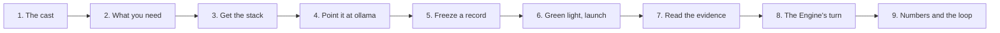
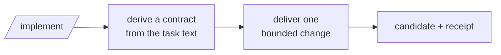
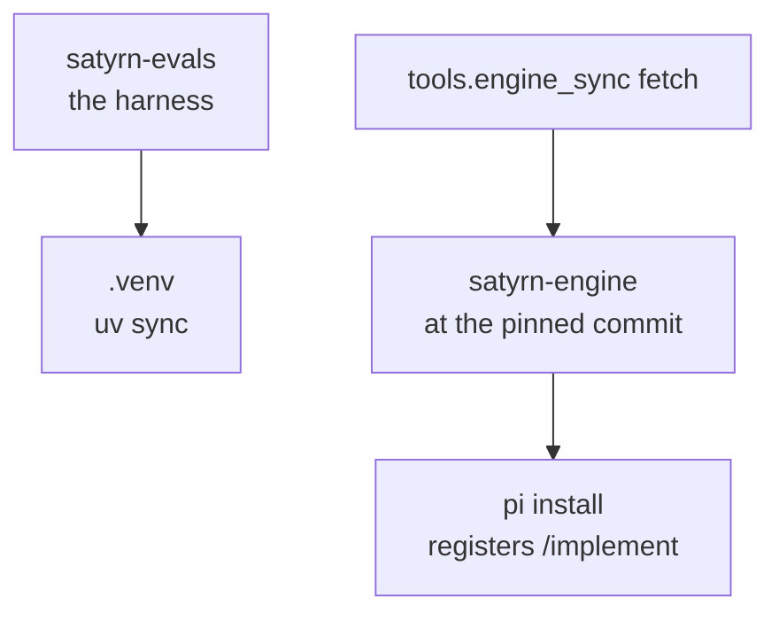
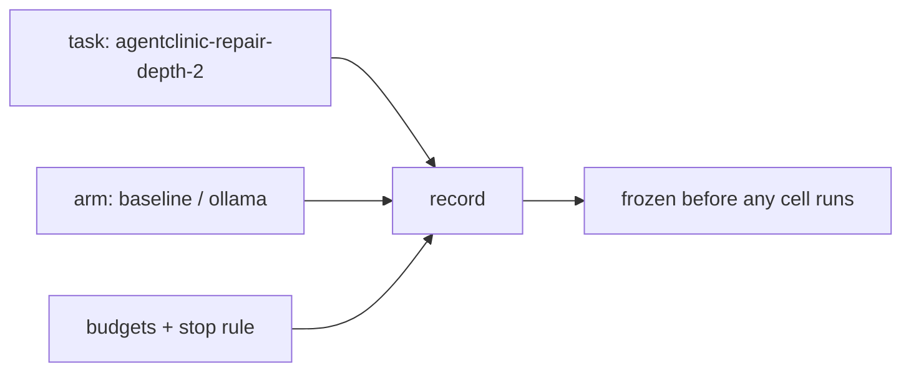
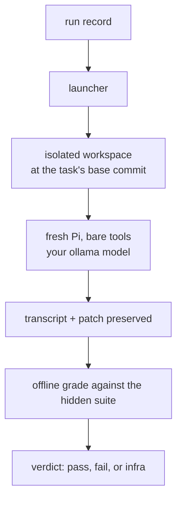
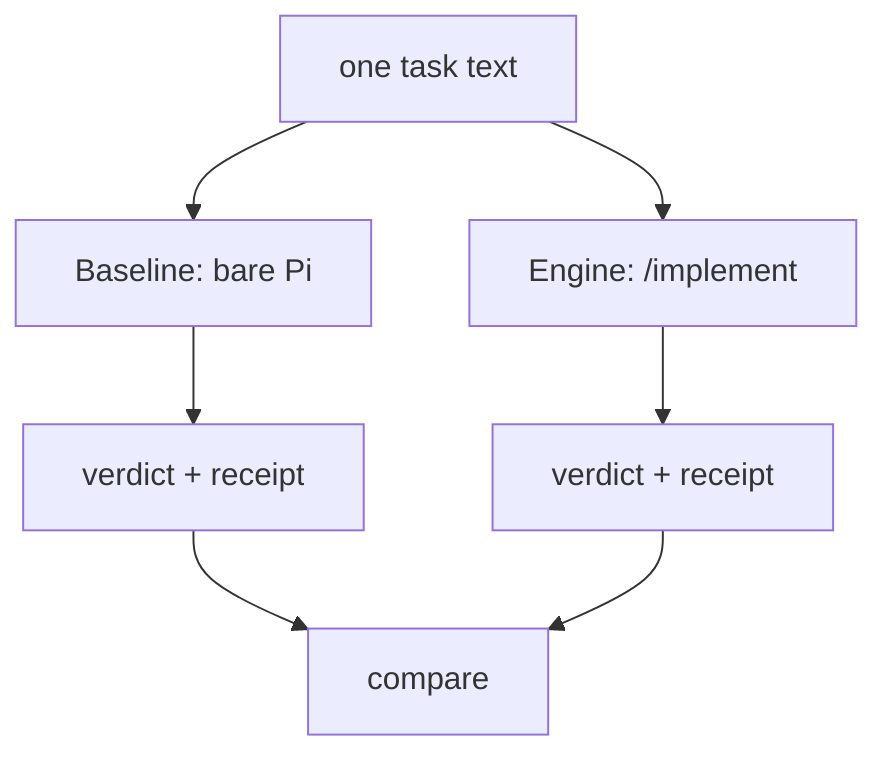

# Your first run

You are about to drive a small model on your own machine through a real
programming task, grade the result from saved evidence, hand the same task to
Satyrn Engine, and report back what you saw. This page walks the whole journey
in order, using **ollama** as the backend. Nothing is skipped and nothing is
assumed.

It is a *journey*, not a reference. When you want to look one flag up, or you
are using a different backend, the dense version is
[Getting started](user-guide.md).

## The journey at a glance



## 1. The cast: what an engine is, and what evals are for

Two words get used a lot here. It is worth ten minutes to know what they mean,
because the rest of the journey is just those two ideas running.

**An engine is the driver.** When you use a coding agent, something sits
between you and the model: it decides what context the model sees, which tools
it can reach, when a loop has gone on too long and should be interrupted, and
which mode you are in — planning, implementing, reviewing. That layer is the
engine. It is not the model and not the terminal UI; it is the part just behind
the UI that coordinates inputs and tools.

**Evals are the tests for the engine.** An engine makes claims — "it keeps a
small model on track", "it stops when your tests go green". Evals are how such
a claim becomes a measurement instead of a story. They drive the engine the way
a test suite drives your code, and they are invisible to you when you use the
engine: you only ever meet the engine.


*The same cast, drawn for the community briefing: your prompt goes to Pi, Pi
asks the Ollama server, the server runs the model, and an eval drives the
whole thing from the side. (Illustration from the
[satyrn-evals-collector](https://github.com/satyrn-ai/satyrn-evals-collector)
repository.)*



`/implement` is the Engine's command inside Pi, and it is two steps: **derive**
turns the task text into a contract, and **deliver** makes one bounded change
against it. That is the thing you will run in step 8.

Two things follow from that picture.

**The engine is independent of the model.** Improving a model updates what it
knows; improving the engine changes how *any* model is driven. That makes the
engine's contribution more general, and it is why this work is worth doing for
small models in particular: the ones that fit on a laptop are the ones that most
need help staying on track.

**Evals come first.** You cannot tell whether a remedy helped until you can
measure the failure it was meant to fix. That ordering — measure, diagnose,
then build — shapes the rest of this journey: you will run the *bare* agent
first, then the Engine, on the same task, and compare two graded results.

*Going deeper:* [How it works](how-it-works.md) tells the whole story in
diagrams; the [glossary](glossary.md) defines task, arm, cell, record, verdict;
[About Satyrn Evals](evals-about.md) says why the harness exists.

## 2. What you need

**A machine that can run a small-ish model.** As a rule of thumb, around
**16 GB of VRAM or shared RAM** for a 9B-class model at a sensible
quantisation. More is more comfortable; less works with smaller models.

**Four tools, and one local model.**

| thing | why | get it |
| --- | --- | --- |
| `git` | the harness works in Git working trees | [git-scm.com/downloads](https://git-scm.com/downloads) |
| `uv` | installs the harness into a local virtual environment | [docs.astral.sh/uv](https://docs.astral.sh/uv/#install) |
| `pi` | the coding agent the harness drives | [pi.dev quickstart](https://pi.dev/docs/latest/quickstart) |
| `ollama` | serves the model over an OpenAI-compatible API | [ollama.com/install.sh](https://ollama.com/install.sh) |

`uv` can fetch the pinned Python (3.14) for you; nothing is installed globally
except the Pi adapter later on. You do **not** need the interactive Pi TUI —
the harness runs Pi headless.

**One model.** This journey uses **Ornith 1.5 9B** as the worked example,
because the committed arms in this repository are cut for it. Other models run
fine — see step 5 — but each needs its own arm and record. The collector's
[briefing](https://github.com/satyrn-ai/satyrn-evals-collector/blob/main/docs/notes/000_engine_engage.md)
keeps a list of candidates by machine size, and is worth reading for the wider
menu.

> **You are here.** Nothing installed yet. Everything below is ordinary user
> software; nothing needs Docker and nothing needs a sandbox.

## 3. Get the stack

From an empty directory:

```bash
# 1. The harness — this repository.
git clone https://github.com/pauleveritt/satyrn-evals.git
cd satyrn-evals
uv sync

# 2. The engine, at the exact commit the pinned arm expects.
uv run python -m tools.engine_sync fetch

# 3. Reach the engine from inside Pi as /implement.
pi install ./satyrn-engine/packages/engine
```



Three notes on those commands, because each one has bitten somebody:

- `fetch` clones `satyrn-engine` **at the commit the Engine arm pins**
  (`54d814d`), and prints the `SATYRN_ENGINE_REPO` value to export. Use the
  printed path.
- `pi install` registers `/implement` **once**, globally. Do not also load the
  engine as a Pi extension with `-e`: you get `/implement` registered twice and
  the plain name stops dispatching.
- `uv sync` touches only this directory. If you are not sure your machine has
  the prerequisites, this is the moment to ask it:

```bash
uv run python scripts/prereqs.py --backend ollama
```

It reports each prerequisite — `git`, `uv`, `pi`, Python, a backend — with a
one-line fix for anything missing, and exits non-zero if something is. A clean
run looks like a short list of `OK` lines and `All N prerequisites are met.`

> **You are here.** The harness and the engine are on disk. No model has run,
> and nothing has been spent.

## 4. Point it at ollama

### Get the model

```bash
curl -fsSL https://ollama.com/install.sh | sh
ollama pull ornith-1.5:9b
```

Ollama now serves `ornith-1.5:9b` at `http://localhost:11434`, and by default
it gives the model **32,768 tokens of context**.

### Tell Pi where the server is

Pi reads `~/.pi/agent/models.json`. Add an `ollama` provider block:

```json
{
  "providers": {
    "ollama": {
      "baseUrl": "http://localhost:11434/v1",
      "api": "openai-completions",
      "apiKey": "ollama",
      "models": [
        {
          "id": "ornith-1.5:9b",
          "contextWindow": 32768,
          "maxTokens": 16000,
          "reasoning": true,
          "samplingParams": {
            "temperature": 0.6,
            "top_p": 0.95,
            "top_k": 20,
            "min_p": 0.0,
            "presence_penalty": 0.0,
            "repetition_penalty": 1.0
          }
        }
      ]
    }
  }
}
```

The `apiKey` is a dummy; Ollama ignores it. The numbers are not decoration:
the settings preflight in step 6 compares them against your arm file and refuses
to run if the two disagree. **Settings are verified here, not declared.** Write
them once, write them right.

`contextWindow` is deliberately 32,768 — that is what Ollama actually serves,
even though the model card advertises far more. To serve more, start Ollama
with `OLLAMA_CONTEXT_LENGTH` set and raise this number to match.

### Name the model for the engine

Two environment variables connect the pieces:

```bash
export SATYRN_ENGINE_REPO="../satyrn-engine"
export SATYRN_MODEL="ollama/ornith-1.5:9b"
```

`SATYRN_MODEL` is a **two-token address**: a provider prefix, then the model the
provider serves. `ollama/` selects the provider block you just wrote, which is
where the server lives; the harness reads that same block to check the server is
actually up. An arm file carries its own model string too, and the record must
agree with both — so keep the arm, the record and `SATYRN_MODEL` equal.

> **You are here.** A model is installed, and the stack knows how to reach it.
> Still nothing spent.

## 5. Freeze a record

Two files decide what a run *is*: an **arm** (which command, which tools, which
model) and a **run record** (which task, which budgets, when to stop). Both are
committed before anything runs, so a result can never be shaped after the fact
by a changed setting.

### The arm

There is no committed ollama arm yet, so make one from the oMLX arm and change
four things:

```bash
cp arms/baseline-ornith15-9b.json arms/baseline-ollama-ornith15-9b.json
```

```diff
+  "backend": "openai",
-  "model": "omlx/Ornith-1.5-9B-MLX-8bit",
-  "server_model": "Ornith-1.5-9B-MLX-8bit",
+  "model": "ollama/ornith-1.5:9b",
+  "server_model": "ornith-1.5:9b",
-    "context_window": 262144,
+    "context_window": 32768,
```

`backend` is an *addition*, not an edit: the oMLX arm carries no such key, and
an absent `backend` means `omlx`. `backend: "openai"` is the harness's name for
*any* OpenAI-compatible server — Ollama is one. `server_model` is the bare id
the server advertises, checked against the server's own `/v1/models`; `model` is
the Pi-facing two-token address. And `context_window` must equal the
`contextWindow` from step 4.

### The record

```bash
uv run satyrn-evals record new \
  --output ./my-record.json \
  --task agentclinic-repair-depth-2 \
  --arm baseline \
  --rung R1 \
  --n 1 --k 1 \
  --purpose development \
  --backend openai \
  --model "ollama/ornith-1.5:9b"

git add ./my-record.json && git commit -m "freeze ollama baseline development record"
```



Notice the small asymmetry, because it catches everyone once: the record is
created with the arm's **name** (`baseline`), while `launch --arm` takes the arm
**file**. `--purpose development` is the friendly setting — it means "I am
learning, this is not a result", and it relaxes the strict record rules that a
campaign needs. The record is committed on purpose; a result that cites an
uncommitted record is not evidence.

> **You are here.** The task, the model, the budgets and the stopping rules are
> fixed. Now the run is a fair test of a stated thing.

## 6. Green light, then launch

A hung or misconfigured backend costs you a wall-clock slot before you notice.
Two checks catch that cheaply.

```bash
# Is the server up, and does it really serve the model you named?
uv run python scripts/prereqs.py --check-servers

# Is the isolated run condition sound, and is the Engine checkout the one
# the arm was measured with?
uv run satyrn-evals launch --preflight ./my-record.json --arm arms/baseline-ollama-ornith15-9b.json
```

The prerequisite check wants `SATYRN_MODEL` exported. The preflight prints a
report; look for an empty `problems` list. A non-empty list names the cause —
usually an unreachable server, or a model id the server does not know. It also
checks the isolated run condition by hunting for anything grader-shaped that a
cell could reach, so give it a minute; `--no-hunt` skips that on a development
record when you would rather move fast.

Then run it:

```bash
uv run satyrn-evals launch ./my-record.json --arm arms/baseline-ollama-ornith15-9b.json
```

`launch` runs one further check before the first cell:
`scripts/preflight_settings.py`, which compares your arm's `inference` block
against the configs that actually govern sampling — Pi's `models.json`, and the
server's own settings file on a backend that has one — and refuses on any
mismatch. This is the check that catches a step-4 entry that drifted away from
your arm, and it is why those numbers are worth getting right.

### What that launch is doing



For the one cell your record names: the harness materialises an isolated
workspace at the task's base commit, runs a fresh Pi against your model with
Pi's own skills, templates, context files and ambient extensions disabled,
preserves the full transcript **and** the patch to directories outside every
Git worktree, and then grades the saved evidence **offline** — no model is
involved in grading. The model never touches the grader material, and nothing a
model writes can hide the result.

> **You are here.** A real model worked on a real task, and a verdict came out
> the other end. This is the moment the whole stack has been aiming at.

## 7. Read the evidence

The run wrote a result JSON, and a **night directory** holding one folder per
cell. The result JSON names the night and, for each cell, its attempt
directory:

```bash
cat ./my-record.result.json

# inside the night directory, per arm and cell:
cat <night>/baseline/<cell-dir>/transcript.txt   # everything the model did
cat <night>/baseline/<cell-dir>/receipt.json     # turns, tool calls, token usage
cat <night>/baseline/<cell-dir>/patch.diff       # the cumulative change from base
cat <night>/baseline/summary.json                # the arm's cells, side by side
```

Three habits make reading this productive.

**Grade from evidence, never from the transcript's ending.** A transcript that
*looks* finished is not a pass; the verdict is what the hidden suite said
against the saved patch. Exit codes and stdout are not verdicts.

**Read the receipt for cost.** Turns, tool calls and output tokens tell you
whether the model solved the task or simply ran until the budget stopped it.
Those are different stories with the same transcript shape.

**If you disagree with the verdict, re-grade — never re-run.** Grading is
offline and deterministic:

```bash
uv run satyrn-evals grade agentclinic-repair-depth-2 <night>/baseline/<cell-dir>/patch.diff
```

Same patch in, same verdict out, no model, no spend. That is the property that
makes every other number on this site trustworthy.

If something went wrong, the reference page has the
[troubleshooting table](user-guide.md#troubleshooting): missing tools,
an unreachable server, a model id the server does not know, a doubled
`/implement`, a cell that is merely slow for the hardware.

> **You are here.** You can run the bare agent and read a graded result from
> retained evidence. That alone is the whole loop.

## 8. Let the Engine take its turn

Now run the *same task* through Satyrn Engine and compare. Same task text, same
model, same budgets, same tools — plus the Engine's `/implement`, which derives
a contract from the task and then delivers one bounded change.



The Engine arm already exists; copy it the same way as the Baseline arm:

```bash
cp arms/engine-ornith15-9b.json arms/engine-ollama-ornith15-9b.json
# the same four changes: add backend "openai", set model ollama/ornith-1.5:9b,
# server_model ornith-1.5:9b, context_window 32768
```

```bash
uv run satyrn-evals record new \
  --output ./my-engine-record.json \
  --task agentclinic-repair-depth-2 \
  --arm engine \
  --rung R1 \
  --n 1 --k 1 \
  --purpose development \
  --backend openai \
  --model "ollama/ornith-1.5:9b"

git add ./my-engine-record.json && git commit -m "freeze ollama engine development record"

uv run satyrn-evals launch --preflight ./my-engine-record.json --arm arms/engine-ollama-ornith15-9b.json
uv run satyrn-evals launch ./my-engine-record.json --arm arms/engine-ollama-ornith15-9b.json
```

Only the agent changes. Everything else — task, model, sampling, budgets,
isolation — is pinned identical, which is exactly why the two results are
comparable at all. `SATYRN_ENGINE_REPO` must point at the checkout `fetch`
made, and the Engine arm's pinned `engine_commit` and file digests mean the
preflight will notice if that checkout is not the one the arm was measured
with.

One honest caveat, and the reason this site exists: **one cell against one cell
proves nothing about the Engine.** It is a flavour of the difference, not a
measurement. To read a measurement, go to the next step and look at how a real
comparison was run.

> **You are here.** You have run both arms yourself, on your own hardware, with
> your own model, and seen what each one delivered.

## 9. Read the numbers, then close the loop

### What the git history already found

The published comparison is a pre-registered one, frozen before any cell ran
and read once when it finished: 24 cells per arm on a medium-build task, on
Ornith 1.5 9B. The Engine delivered a passing candidate inside the budget 16 of
24 times; bare Pi 2 of 24. The interesting part is *why*: most bare-Pi cells had
already built a passing tree and never handed it over — they kept working and
ran out of budget. That is a finishing failure, not a capability one.

Read [First results](numbers.md) — including where the Engine did **not** help
(it adds nothing measurable on tasks bare Pi already finishes, and it costs more
on small repairs), what it costs per delivered pass, and the disclosed limits of
the instrument. Then [the stated negative](release-one-negative.md) for the
release where the engine team built a remedy for failures that turned out to be
the harness's own.

### What happens next: send us your run

This is the part the journey is really for. The harness can prove things about
*this* machine and *this* model. What it cannot know is how local models behave
in the wild — on other hardware, other quantisations, other extensions, other
problems. That is the missing baseline, and you are the only source of it.

Here is the whole procedure, with no suspense:

1. **Fork** [satyrn-ai/satyrn-evals-collector](https://github.com/satyrn-ai/satyrn-evals-collector)
   and create a branch.
2. **Make a folder** named
   `reports/YYYY-MM-DD_<author>_<topic>/` — a self-contained record of one
   experiment.
3. **Copy the template** at
   [`reports/0000-00-00_example_template/report.md`](https://github.com/satyrn-ai/satyrn-evals-collector/blob/main/reports/0000-00-00_example_template/report.md)
   into it and fill it in. The header asks for the model and quantisation, your
   hardware, your `pi --version`, and the extensions and skills you used; the
   body asks for your experience, the problem, how the setup went, and what
   worked and what didn't.
4. **Add your data** — the transcript, logs, screenshots — to the same folder.
   Entire transcripts are welcome.
5. **Redact before you commit.** Everything in that repository is public. Strip
   personal data, keys and secrets first; if you are unsure, redact it.
6. **Open a pull request** against `main`.

What happens to it after that, concretely: the engine team reads reports as the
ground-truth baseline for what local-model work actually looks like — and
reports become evidence in naming the failures worth measuring, with the strong
possibility that a reported problem turns into a new eval task of its own. Your
report is published under the repository's license and may be cited. You are
also asked to keep exactly two things fixed — **use Pi**, and **use a local
model** — and to vary everything else deliberately, especially the problem and
the Pi extensions, skills and plugins you bring.

Two tracks are open, and both are equally welcome: the novice-friendly starter
package (set up Ollama and Pi, pick a Python problem, try it with plain Pi and
with some extensions), and advanced topics the team is especially hungry for —
keeping context size under control, whether LSP integration actually works in
practice, and anything that manages subagents. The full briefing, with the
model suggestions and starter problems, is
[`docs/notes/000_engine_engage.md`](https://github.com/satyrn-ai/satyrn-evals-collector/blob/main/docs/notes/000_engine_engage.md).

> **You are here.** You ran the harness, you ran the Engine, you read the
> numbers, and you sent back what only you could see. That is the loop this
> whole project runs on — and you are now part of it.