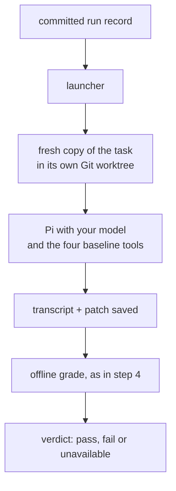

# Your first run

You are about to drive a small model on your own machine through a small
Python task, grade the result from saved evidence, and send back what you saw.
This page walks the whole journey in order, with **ollama** as the backend and
four commands: `init`, `doctor`, `run`, `report`. Nothing is skipped and
nothing is assumed.

It is a *journey*, not a reference. When you want to look one flag up, or you
are using a different backend, the dense version is
[Getting started](user-guide.md).

<!-- TODO(benx): this page is written against the cli-ux branch. Drop the
`git switch cli-ux` line in step 3 once it merges. -->

## The journey at a glance


```mermaid
flowchart LR
  A[1. The cast] --> B[2. What you need]
  B --> C[3. Get satyrn-evals]
  C --> D[4. Watch it grade]
  D --> E[5. Point Pi at ollama]
  E --> F[6. Ask the doctor]
  F --> G[7. Freeze, then run]
  G --> H[8. Read the result]
  H --> I[9. The Engine's turn]
  I --> J[10. Send us your run]
```

## 1. The cast: what an engine is, and what evals are for

Two words get used a lot here. It is worth ten minutes to know what they mean,
because the rest of the journey is just those two ideas running.

**An engine is the driver.** When you use a coding agent, something sits
between you and the model. It decides what context the model sees, which tools
it can reach, when a loop has gone on too long, and which mode you are in:
planning, implementing, reviewing. That layer is the engine. It is not the
model and not the terminal UI.

**Evals are the tests for the engine.** An engine makes claims, such as "it
keeps a small model on track". Evals turn a claim like that into a measurement
instead of a story. They drive the agent the way a test suite drives your code.


*Your prompt goes to Pi, Pi asks the Ollama server, the server runs the model,
and an eval drives the whole thing from the side. (Illustration from the
[satyrn-evals-collector](https://github.com/satyrn-ai/satyrn-evals-collector)
repository.)*

**Evals come first.** You cannot tell whether a remedy helped until you can
measure the failure it was meant to fix. So this journey runs the *bare* agent
first, on a task with a known answer, and reads the verdict from evidence.

*Going deeper:* [How it works](how-it-works.md) tells the whole story in
diagrams; the [glossary](glossary.md) defines task, arm, cell, record and
verdict; [About Satyrn Evals](evals-about.md) says why the harness exists.

## 2. What you need

**A machine that can run a small model.** The project's target is a laptop
with **16 GB of RAM or shared memory**. A GPU makes everything faster, but it
is not required: every command on this page was run on a CPU-only laptop.

**Four tools, and one local model.**

| thing | why | get it |
| --- | --- | --- |
| `git` | the harness freezes and isolates runs in Git | [git-scm.com/downloads](https://git-scm.com/downloads) |
| `uv` | installs the harness and fetches Python 3.14 for it | [docs.astral.sh/uv](https://docs.astral.sh/uv/#install) |
| `pi` | the coding agent the harness drives, headless | [pi.dev quickstart](https://pi.dev/docs/latest/quickstart) |
| `ollama` | serves the model on your machine | [ollama.com/download](https://ollama.com/download) |

**One model.** This journey uses **Ornith 1.5 9B** as the worked example. Any
model ollama serves will do; step 3 shows where to change it.

**How long it takes.** These are measured on one laptop with an Intel i5-10210U,
16 GB of RAM and no GPU. A GPU machine will be much faster. Treat them as an
upper bound, not a promise.

| step | time on that laptop |
| --- | --- |
| clone and `uv sync` | a few minutes |
| grading a patch offline (step 4) | under a second |
| one run of the example task with Ornith 1.5 9B (step 7) | about 10 minutes |

> **You are here.** Nothing installed yet. Everything below is ordinary user
> software. Nothing needs Docker and nothing needs a sandbox.

## 3. Get satyrn-evals

satyrn-evals is not on PyPI yet, so you run it from a clone:

```bash
mkdir -p ~/satyrn && cd ~/satyrn
git clone https://github.com/pauleveritt/satyrn-evals.git
cd satyrn-evals
git switch cli-ux
uv sync
source .venv/bin/activate
satyrn-evals --help
```

`uv sync` creates a virtual environment inside the clone and installs the
harness into it. Activating it puts the `satyrn-evals` command on your path
for this terminal. Open a new terminal later, and you activate it again.

The help lists four commands at the top. They are the whole journey:

```text
init     scaffold satyrn.yaml, an example task, and a starter arm here
doctor   check this machine and the configured backend
run      write the configured record and launch its cells
report   show a readable result for a finished run
```

Below them sit the expert commands (`grade`, `qualify`, `attempt`, `launch`,
`record` and more). You will meet one of them in the next step.

> **You are here.** The harness is installed. No model has run, and nothing
> has been spent.

## 4. Make a project and watch it grade

Your evals live in their own folder, next to the clone rather than inside it.
`init` creates one:

```bash
cd ~/satyrn
satyrn-evals init my-first-eval --model ollama/ornith-1.5:9b --backend openai
cd my-first-eval
```

```text
wrote my-first-eval/satyrn.yaml
wrote my-first-eval/eval-tasks/format_number
wrote my-first-eval/arms/baseline.json
next: edit satyrn.yaml, then run `satyrn-evals doctor`
```

You passed the model on the command line, so there is nothing to edit yet.
Three things are now on disk:

- **`satyrn.yaml`** says what to run: the task, the arm, the model, and the
  budgets (one attempt, 32,000 tokens, 48 turns, 60 minutes).
- **`eval-tasks/format_number`** is the example task: a `solution.py` with a
  stub `format_number(n)`, four tests, and two ready-made patches, one right
  and one wrong.
- **`arms/baseline.json`** says *how* to run: bare Pi with four tools (`read`,
  `bash`, `edit`, `write`) and your model.

Two notes on that `init` line. `--model` is a **two-part address**: the provider
name Pi knows (`ollama`), then the model id that provider serves
(`ornith-1.5:9b`). And `--backend openai` is right for ollama: to the harness,
`openai` means *any* server that speaks the OpenAI API, and ollama is one.

> **Do not pass `--backend ollama`.** `init` accepts it, but `run` then
> refuses the record with `backend must be one of omlx, openai`. Use
> `--backend openai`.

<!-- TODO(benx): drop the warning once init and the record agree on the
backend names (asked hixi). -->

Before any model gets involved, see the part that makes everything else
trustworthy: grading. Hand the grader the right patch, then the wrong one:

```bash
satyrn-evals grade format_number eval-tasks/format_number/fixtures/known-good.patch \
  --tasks-root eval-tasks --receipt /tmp/good.json
satyrn-evals grade format_number eval-tasks/format_number/fixtures/known-broken.patch \
  --tasks-root eval-tasks --receipt /tmp/broken.json
```

`grade` prints nothing; it writes a receipt. Open both:

```bash
cat /tmp/good.json /tmp/broken.json
```

The first says `"verdict": "pass"` with 4 tests passed. The second says
`"verdict": "fail"`, 2 passed and 2 failed. No model, no network, under a
second each. The grader applied each patch to a clean copy of the task, ran the
tests, and read the result from evidence the test run wrote, never from an
exit code. Every verdict you will see later comes from this same machinery.

> **You are here.** You have a project, and you have seen the grader tell a
> right answer from a wrong one. Still no model, still nothing spent.

## 5. Point Pi at ollama

### Get the model

Install ollama from [ollama.com/download](https://ollama.com/download), then:

```bash
ollama pull ornith-1.5:9b
```

Ollama now serves the model at `http://localhost:11434`.

**Give it enough context.** A coding agent fills a small context window with
its system prompt and tool definitions before your task even starts. Set
`OLLAMA_CONTEXT_LENGTH` to `32768` before you run anything. On Linux, the
official installer runs ollama as a system service, so an `export` in your
shell does not reach it. The how-to
[Configure Ollama with environment variables](https://satyrn-ai.github.io/satyrn-zen/create/howto-ollama-env-vars/)
shows how to set it for each way of running ollama, and how to check it took.

<!-- TODO(benx): the zen link goes live when satyrn-zen PR #25 merges. -->

### Tell Pi where the server is

Pi reads its models from `~/.pi/agent/models.json`. `init` does not write this
file, so add an `ollama` provider yourself:

```json
{
  "providers": {
    "ollama": {
      "baseUrl": "http://localhost:11434/v1",
      "api": "openai-completions",
      "apiKey": "ollama",
      "models": [
        {
          "id": "ornith-1.5:9b",
          "contextWindow": 32768,
          "maxTokens": 16000,
          "reasoning": true,
          "samplingParams": {
            "temperature": 0.6,
            "top_p": 0.95,
            "top_k": 20,
            "min_p": 0.0,
            "presence_penalty": 0.0,
            "repetition_penalty": 1.0
          }
        }
      ]
    }
  }
}
```

If the file already exists, add the `ollama` block inside `providers` instead
of replacing the file. The `apiKey` is a dummy; ollama ignores it.

This entry is **required**. Before the first attempt, `run` checks that Pi has
an entry for the exact model in your arm, and stops if it does not. The `id`
must match the part after `ollama/` in your `--model`, and `contextWindow` must
match what ollama actually serves.

<!-- TODO(benx): asked hixi whether init should write this entry. Also: the
starter arm has no `inference` block, so today the settings check only finds
the entry, it does not compare its values. -->

> **You are here.** A model is installed, and Pi knows how to reach it.
> Still nothing spent.

## 6. Ask the doctor

From inside `my-first-eval`:

```bash
satyrn-evals doctor --check-servers
```

```text
satyrn prerequisites:

  git            OK   /usr/bin/git
  python         OK   python 3.14.6
  uv             OK   /home/you/.local/bin/uv
  pi             OK   /home/you/.local/bin/pi
  model backend  OK   ollama
  model server   OK   ollama/ornith-1.5:9b

All 6 prerequisites are met.
```

`doctor` reads `satyrn.yaml` from the current folder or the nearest one above
it. `--check-servers` adds the last line: it asks the running ollama server
whether it really serves the model you named. Anything missing comes with a
one-line fix, and `doctor` exits non-zero until it is fixed. A hung or
misconfigured backend is cheaper to find here than ten minutes into a run.

> **You are here.** The machine, the server and the model all answer. The next
> step spends real time.

## 7. Freeze, then run

A run is defined by a **run record**: which task, which arm, which model,
which budgets, when to stop. The harness insists that the record is
**committed to Git, unchanged**, before anything runs. That way a result can
never be shaped after the fact by a changed setting, and anyone can check
exactly what was run.

So the project needs to be a Git repository, and the record needs to exist
before you commit:

```bash
git init
satyrn-evals run --dry-run
git add .
git commit -m "freeze my first run"
```

`run --dry-run` writes the record to `records/format_number.json` and checks
it, without spending anything:

```text
wrote .../my-first-eval/records/format_number.json; commit it, unchanged, before launch
record accepted: task format_number, arm baseline, model ollama/ornith-1.5:9b, n=1, k=1
```

Now run it for real:

```bash
satyrn-evals run
```

On the CPU-only laptop above, this took about ten minutes with Ornith 1.5 9B.
While it runs, here is what happens:


```mermaid
flowchart TB
  R[committed run record] --> L[launcher]
  L --> W[fresh copy of the task<br/>in its own Git worktree]
  W --> P[Pi with your model<br/>and the four baseline tools]
  P --> E[transcript + patch saved]
  E --> G[offline grade, as in step 4]
  G --> V[verdict: pass, fail or unavailable]
```

The harness makes a fresh copy of the task, runs Pi against your model with
Pi's own skills, templates and extensions switched off, keeps the agent inside
the task folder, saves the full transcript and the patch, and then grades the
saved patch offline. No model is involved in grading.

**If `run` stops before the first attempt**, the message says why. The three
you are most likely to meet:

- *the run record is not frozen*: the record is missing from a commit, or
  changed since. Commit it, then run again.
- *... belongs to another record*: results go to `~/satyrn-runs/<task>/`, and
  a run of a different record on the same task already lives there. Move it
  aside, for example
  `mv ~/satyrn-runs/format_number ~/satyrn-runs/format_number-old`.
- *pi: no entry for this model in models.json*: go back to step 5.

<!-- TODO(benx): the first two are cli-ux snags reported to hixi; trim this
box if init/run start handling them. -->

> **You are here.** A real model worked on a real task, and a verdict came out
> the other end. This is the moment the whole stack has been aiming at.

## 8. Read the result

```bash
satyrn-evals report
```

```text
task:     format_number
rung:     contract
purpose:  development
status:   complete
cells:    1

arm baseline: 1/1 passed (OK=1)
```

One attempt, one pass. The evidence behind that line is on disk, in
`~/satyrn-runs/format_number/`:

```bash
cd ~/satyrn-runs/format_number/baseline
cat summary.json                   # every attempt: verdict, tool calls, pathology counters
cat format_number-*/transcript.txt # everything the model did
cat format_number-*/patch.diff     # the change it made, from the task's base
cat format_number-*/receipt.json   # the grade: verdict and test counts
```

**There are three verdicts, not two.**

| verdict | means |
| --- | --- |
| `pass` | the patch makes the hidden tests pass |
| `fail` | the patch was graded, and tests fail |
| `unavailable` | the patch could not be graded at all |

`unavailable` is not a polite `fail`. It says the result cannot be judged, and
`receipt.json` says why. A real example: with a 4B model on this same task,
the agent never opened `solution.py`. It wrote its answer into a brand-new file
instead, and the verdict was `unavailable` with the reason
`patch touches non-source path`. The task only allows changes to
`solution.py`. Its code was in fact correct: pasted into `solution.py` by hand,
it passed all four tests. The model could solve the problem; it did not work
on the repository the way the task asked. That gap, between knowing the answer
and delivering it properly, is exactly what an engine is for.

**Grade from evidence, never from the transcript's ending.** A transcript that
*looks* finished is not a pass. The verdict is what the tests said against the
saved patch.

**If you disagree with a verdict, re-grade, never re-run.** Grading is offline
and deterministic, the same command as in step 4:

```bash
cd ~/satyrn/my-first-eval
satyrn-evals grade format_number ~/satyrn-runs/format_number/baseline/format_number-*/patch.diff \
  --tasks-root eval-tasks --receipt /tmp/regrade.json
```

Same patch in, same verdict out, no model, no spend.

If something else went wrong, the reference page has the
[troubleshooting table](user-guide.md#troubleshooting).

> **You are here.** You can run the bare agent and read a graded result from
> retained evidence. That alone is the whole loop.

## 9. The Engine's turn

The next question is whether Satyrn Engine does better than bare Pi on the same
task: same model, same budgets, same tools, plus the Engine's `/implement`.

`init` scaffolds only the Baseline arm today. Running the Engine arm still
takes the longer path, with the Engine checked out at the commit its arm pins:
follow [Getting started](user-guide.md) from "Install the stack".

<!-- TODO(benx): rewrite this step when init can scaffold an Engine arm. -->

One honest caveat: **one attempt against one attempt proves nothing.** It is a
flavour of the difference, not a measurement. For how a real comparison is
run, read [First results](numbers.md), including where the Engine did *not*
help, and [the stated negative](release-one-negative.md).

## 10. Send us your run

This is the part the journey is really for. The harness can prove things about
*this* machine and *this* model. What it cannot know is how local models behave
in the wild: on other hardware, other quantisations, other problems. You are
the only source of that.

1. **Fork** [satyrn-ai/satyrn-evals-collector](https://github.com/satyrn-ai/satyrn-evals-collector)
   and create a branch.
2. **Make a folder** named `reports/YYYY-MM-DD_<author>_<topic>/`.
3. **Copy the template** at
   [`reports/0000-00-00_example_template/report.md`](https://github.com/satyrn-ai/satyrn-evals-collector/blob/main/reports/0000-00-00_example_template/report.md)
   into it and fill it in: model and quantisation, hardware, `pi --version`,
   then what you did and how it went.
4. **Add your evidence**: the `report` output, `summary.json`, the transcript.
5. **Redact before you commit.** Everything in that repository is public.
6. **Open a pull request** against `main`.

The team reads reports as the ground truth for what local-model work actually
looks like, and a reported problem can become a new eval task of its own. The
full briefing, with model suggestions and starter problems, is
[`docs/notes/000_engine_engage.md`](https://github.com/satyrn-ai/satyrn-evals-collector/blob/main/docs/notes/000_engine_engage.md).

> **You are here.** You ran the harness, read the evidence, and sent back what
> only you could see. That is the loop this whole project runs on.
