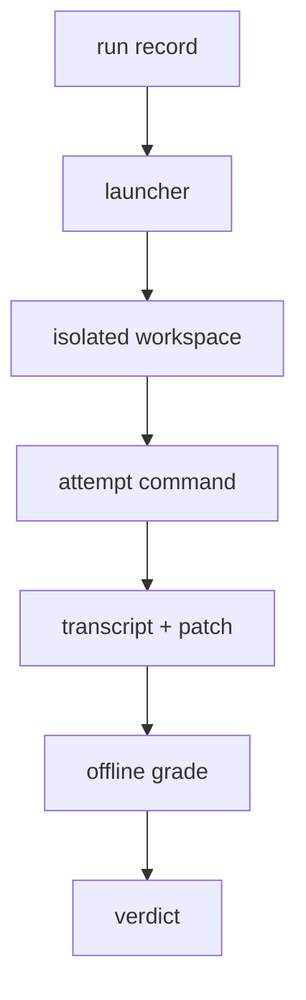

# Evals architecture

The physical run, start to finish.

1. A **run record** is frozen first — task, arm, model, budget, and the
   decision rule — and committed before any cell runs.
2. The **launcher** reads the record and runs its cells, arms interleaved.
3. Each **cell** is an isolated workspace: a linked Git worktree at the base
   commit, materialized with the task, run as a second user that cannot see
   grader material.
4. The **attempt command** runs the model headless as a subprocess in that
   workspace (bare Pi for Baseline, the Engine for the Engine arm).
5. The harness captures the **transcript** (the model's stream) and harvests
   the **patch** (the diff since base).
6. **Grading is offline**: the oracle test hook runs the hidden suite against
   the patched workspace and produces the verdict — never stdout, never an
   exit code.

