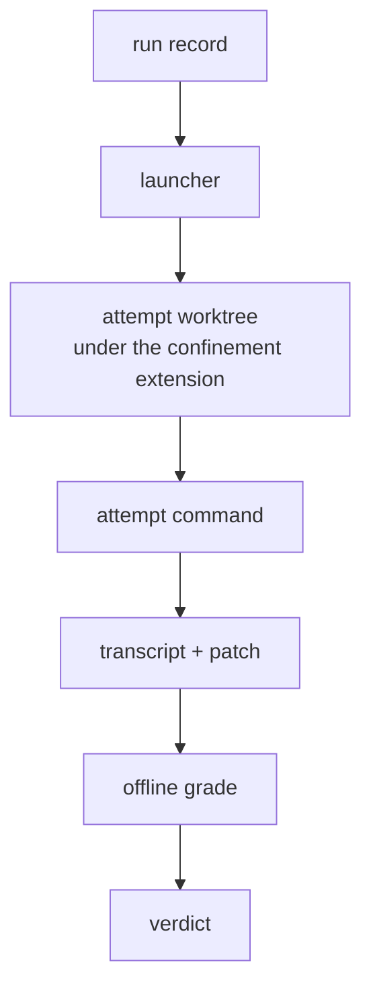

# Evals architecture

The physical run, start to finish.

1. A **run record** is frozen first — task, arm, model, budget, and the
   decision rule — and committed before any cell runs.
2. The **launcher** reads the record and runs its cells, arms interleaved.
3. Each **cell** is one attempt: the task run once, under one arm, in its
   own attempt worktree under the confinement extension. The worktree is a
   linked Git worktree at the base commit, materialized with the task. The
   eval's confinement extension, loaded by both arms, refuses a file tool
   whose path resolves outside the worktree and a `bash` command that names
   a protected root or grader material, and records every refusal.
4. The **attempt command** runs the model headless as a subprocess in that
   worktree: Pi with no product extensions plus the eval's confinement
   extension for Baseline, the Engine's `/implement` for the Engine arm.
   A cell with no refusals and no reaches is **admitted**; only admitted
   cells enter a deciding denominator.
5. The harness captures the **transcript** (the model's stream) and harvests
   the **patch** (the diff since base).
6. **Grading is offline**: the oracle test hook runs the hidden suite against
   the patched worktree and produces the verdict — never stdout, never an
   exit code.

```mermaid
flowchart TB
  R[run record] --> L[launcher]
  L --> W[attempt worktree<br/>under the confinement extension]
  W --> A[attempt command]
  A --> T[transcript + patch]
  T --> G[offline grade]
  G --> V[verdict]
```
