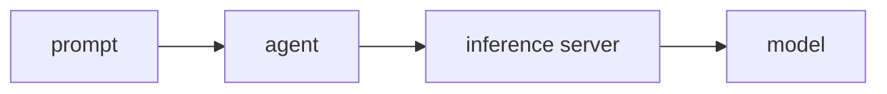
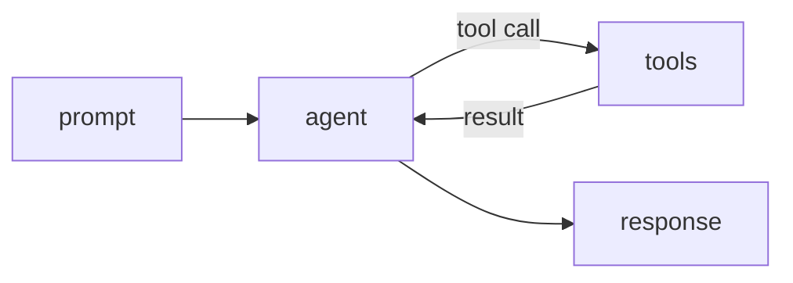
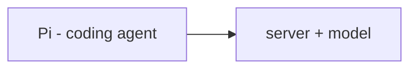
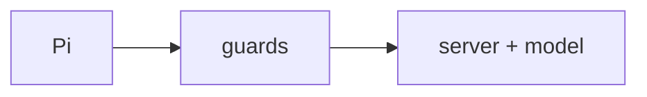
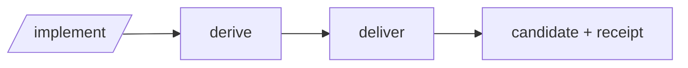
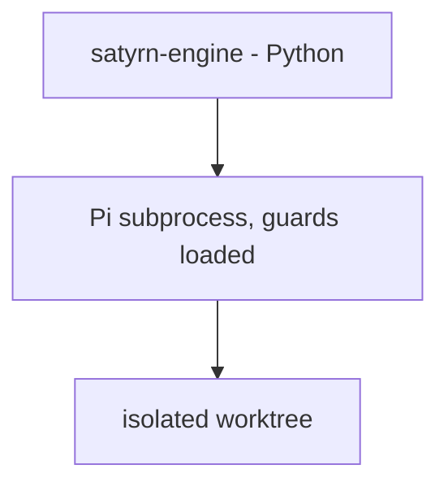
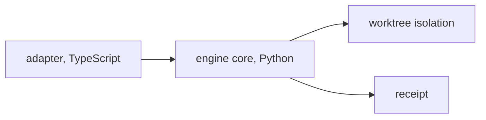
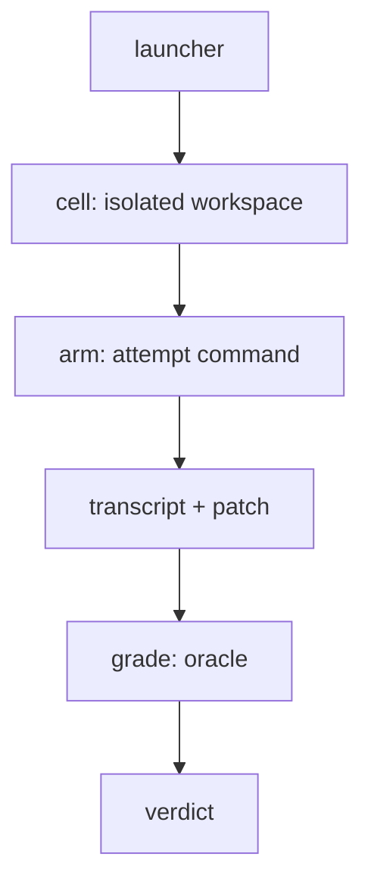

# How it works

The whole story, from a prompt to an eval verdict, in three sections. Each
section hides the previous section's "out there" complexity and collapses it
to one block.

## How agents work

A prompt goes to an agent, which talks to an inference server, which runs a
model:

Add tools, a loop, and planning:

Running locally, the same shape: Pi is the agent, oMLX serves Ornith 1.5 9B.

## How the Engine works

Pi is the coding agent; the server and model collapse to one block:

Add guards — the loop breaker, writable-path scope, symbol preservation, and
command bounds:

Add `/implement`, at a high level: derive a contract, then deliver:

The Engine's pieces: a Python core runs a fresh Pi subprocess, guards loaded,
in its own isolated worktree:

Worktree isolation and the logical pieces inside:

## How Evals works

The logical pieces of the eval system, in the glossary's words:

The *physical* run — how the launcher makes the workspace and runs the model
as a subprocess — is on the [Architecture](evals-architecture.md) page.
